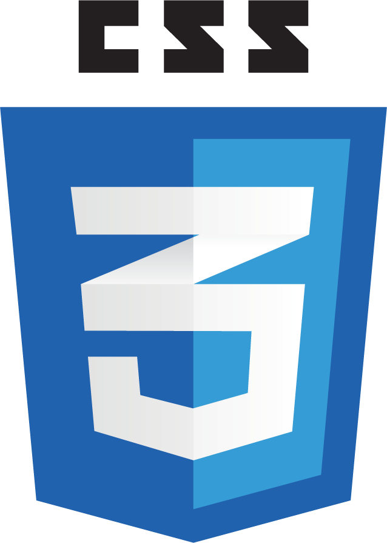

    <h1>Heart Of Orel Web-Site</h1>

<h2> :heart: Общая информация</h2>

Данный сайт посвящён достопримечательностям города Орла, Российской Федерации. На нём будет показана основная информация о них.
Сайт был разработан в виде продукта и практической части курсовой работы "Обучение служением" по дисциплине "Основы российской государственности" на 1 курсе университета. Ниже приведу функции, которые на данный момент доступны на сайте.

:heavy_check_mark: Регистрация, авторизация пользователя.    
:heavy_check_mark: Личный профиль каждого пользователя.     
:heavy_check_mark: Возможность добавлять и удалять комментарии под каждое место.    
:heavy_check_mark: Разделение возможностей между пользователями и администраторами.    

<h2> Какие технологии я использовал?</h2>
<h3 align="center">BACKEND</h3>

<b>Django</b>. Замечательный фреймворк для веб-разработки, использующий Python для программирования Backend части проекта.

  

<b>Python.</b> Собственно язык программирования, который я использовал с фреймворком Django.

  

<b>База данных PostgreSQL.</b> База данных, в которой хранятся все данные: пользователи, комментарии и прочие таблицы, необходимые для работы.

  

<h3 align="center">FRONTEND</h3>

<b>HTML5.</b> Язык гипертекстовой разметки, без которого не обходится ни один веб-сайт.

  

<b>CSS3.</b> Язык таблицы стилей. Думаю не стоит пояснять, что он делает.

  

<b>JavaScript.</b> Ещё один язык программирования, но уже во Frontend. Широко используемый ЯП в веб-разработке.

  

    

<h1>
     Крупное обновление 2025:
    
</h1>

<h2>
     Что же изменилось?
    

    <ul>
        <li>На сайт была добавлена регистрация, авторизация и личный профиль пользователя.
        
        </li>
        

        <li>Весь сайт был перенесён на новую базу данных. С dbsqlite3 на PostgreSQL. </li>
        

        <li>Проведена оптимизация базы данных и подготовка к следующему этапу в разработке. </li>
    </ul>
</h2>